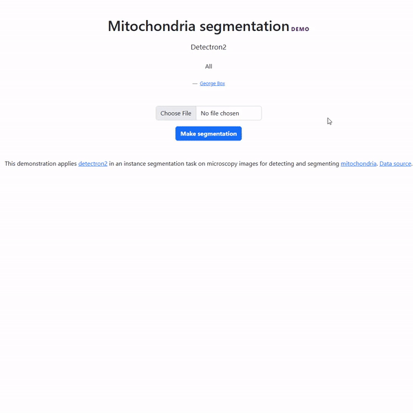

<details>
  <summary>Table of Contents</summary>
  <ol>
    <li>
      <a href="#introduction">Introduction</a>
    </li>
    <li><a href="#demo">Demo</a></li>
    <li><a href="#technical-tools">Technical Tools</a></li>    
    <li><a href="#data-source">Data source</a></li>
    <li><a href="#how-to-use-the-source-code">How to use the source code</a></li>
    <li><a href="#reference">Reference</a></li>
  </ol>
</details>

### Introduction

<ul style="padding-left: 20px; list-style-type: circle;">
        <li>The project includes 5 repositories:
            <ul>
                <li>
                <a href="https://github.com/LeoUtas/Mitochondria_segmentation_research_detectron2.git" style="text-decoration: none; color: #3498db;">Mitochondria instance segmentation research using Detectron2</a>
                </li>
                <li>
                <a href="https://github.com/LeoUtas/Mitochondria_segmentation_research_YOLOv8.git" style="text-decoration: none; color: #3498db;">Mitochondria instance segmentation research using YOLOv8</a>
                </li>                
                <li>
               <a href="https://github.com/LeoUtas/Mitochondria_segmentation_flask_detectron2.git" style="text-decoration: none; color: #3498db;">Mitochondria instance segmentation web application using Detectron2</a>
                </li>
                <li>
                <a href="https://github.com/LeoUtas/Mitochondria_segmentation_flask_YOLOv8.git" style="text-decoration: none; color: #3498db;">Mitochondria instance segmentation web application using YOLOv8</a>
                </li>
                <li>
                <a href="https://github.com/LeoUtas/Mitochondria_segmentation_flask_2models.git">Mitochondria instance segmentation web application using Detectron2 and YOLOv8 for better comparison</a>
                </li>
            </ul>
        </li>
        <br>
        <li>
            I attempted to solve the mitochondria instance segmentation using 2 different tools (i.e., <a href="https://github.com/facebookresearch/detectron2/blob/main/README.md">Detectron</a> and <a href="https://github.com/ultralytics/ultralytics"> YOLOv8 </a>). The results indicated that, for this particular task, Detectron2 demonstrated superior performance over YOLOv8. However, in some cases, YOLOv8 performed better on the task of object detection.
            Detectron2 was chosen to deploy on a web application for this instance segmentation tasks <a href="https://mito-app-651cbfda9bde.herokuapp.com/">(visit the live demo)</a>.
        </li>        
    </ul>

This repository hosts the source code for a web application using Detectron2 <a href="https://mito-app-651cbfda9bde.herokuapp.com/">(visit the live demo)</a>.

### Demo

<p align="center">
  <a href="GIF">
    
  </a>
</p>

<p align="justify">
  <a href="https://mito-app-651cbfda9bde.herokuapp.com/">
    Live demo
  </a>
</p>

### Technical tools

The application documentation of <a href="https://detectron2.readthedocs.io/en/latest/"> Detectron2 </a> by Facebook research.

-   Pytorch
-   Detectron2
-   numpy
-   pandas
-   opencv-python
-   scikit-image
-   Flask
-   JavaScript (plain)
-   HTML
-   CSS (Bootstrap)
-   Docker
-   Github Action

### Data source

This project utilizes an electron microscopy image dataset from the CA1 area of the hippocampus, annotated for mitochondria by highly trained researchers. For more information and access to the dataset, visit the <a href="https://www.epfl.ch/labs/cvlab/data/data-em/"> Electron Microscopy Dataset</a>.

### How to use the source code

-   Fork/clone this repository (https://github.com/LeoUtas/Mitochondria_segmentation_flask_YOLOv8.git)
-   Get the docker container ready

    -   Run docker build (name the app whatever you want on your local machine, and please note that it might take a while for installing all the required dependencies to your local docker image)

    ```cmd
    docker build -t <name of the app> .
    ```

    -   Run the Docker Container (once the docker image is built, you will run a docker container, map it to the port 5000)

    ```cmd
    docker run -p 5000:5000 -v "$(PWD):/app" --name <name of the container> <name of the docker image>
    ```

<br>

I'm thrilled to share it with you all! Dive in and enjoy exploring its features. A big thank you for your interest and for journeying this far with me. Wishing you a fantastic day ahead!

Best,
Hoang Ng

### Reference

Wu, Y., Kirillov, A., Massa, F., Lo, W.-Y., & Girshick, R. (2019). Detectron2. Retrieved from https://github.com/facebookresearch/detectron2.
